# ggDoE
[](https://cran.r-project.org/package=ggDoE)
[](https://github.com/toledo60/ggDoE/actions)
[](https://ggdoe.netlify.app/)

```{r,echo=FALSE}
knitr::opts_chunk$set(
  eval = FALSE, fig.width = 6
)
```


## Installation

You can install:

* the latest release from CRAN with 

```{r}
install.packages('ggDoE')
```

* the development version from GitHub with

```{r,eval=FALSE}
if (!require("remotes")) install.packages("remotes")
remotes::install_github("toledo60/ggDoE")
```

## Overview

With ggDoE you'll be able to generate common plots used in Design of Experiments with ggplot2.


```{r,eval=TRUE}
library(ggDoE)
```

The following plots are currently available:

**Alias Matrix**

Correlation matrix plot to visualize the Alias matrix

```{r}
alias_matrix(design=aliased_design)
```

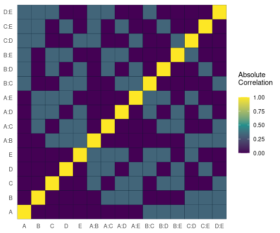


**Box-Cox Transformation**


```{r}
model <- lm(s2 ~ (A+B+C+D),data = adapted_epitaxial)
boxcox_transform(model,lambda = seq(-5,5,0.2))
```


**Lambda Plot**

Obtain the trace plot of the *t*-statistics after applying Boxcox transformation across a specified sequence of lambda values 

```{r}
model <-  lm(s2 ~ (A+B+C)^2,data=original_epitaxial)
lambda_plot(model)
```

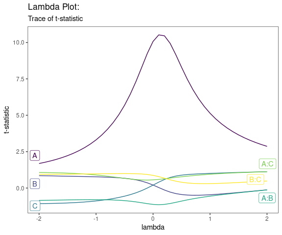


```{r}
lambda_plot(model, lambda = seq(0,2,by=0.1))
```

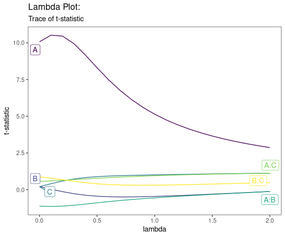


**Boxplots**

```{r}
data <- ToothGrowth
data$dose <- factor(data$dose,levels = c(0.5, 1, 2),
                    labels = c("D0.5", "D1", "D2"))

gg_boxplots(data,response = 'len',
            factor = 'dose')
```

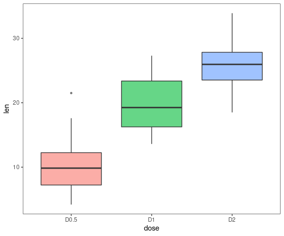


```{r}
gg_boxplots(data,response = 'len',
            factor = 'dose',
            group_var = 'supp',
            color_palette = 'viridis',
            jitter_points = TRUE)
```


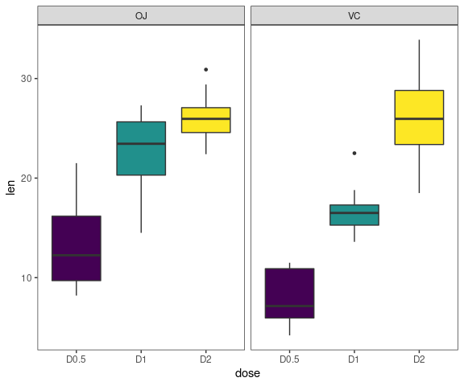

**Regression Diagnostic Plots**

1. Residual vs. Fitted Values
2. Normal-QQ plot
3. Scale-Location plot
4. Residual vs. Leverage
5. Cook's Distance
6. Collinearity

The default plots are 1-4

```{r,fig.height=10,fig.width=8}
model <- lm(mpg ~ wt + am + gear + vs * cyl, data = mtcars)
diagnostic_plots(model,which_plots=1:6)
```


**GLM Diagnostic Plots**

1. Residual vs. Fitted Values  
2. Working Responses vs Linear Predictors  
3. Normal Q-Q plot  
4. Outlier Detection  
5. Half norm plot using leverages  
6. Half norm plot using Cook's Distance  
7. Cook's Distance  
8. DFFITS  
9. Collinearity  

The default plots are 1-4

```{r,fig.height=10,fig.width=8}
glm_model <- glm(Volume ~ log(Girth) + log(Height), family = Gamma(link = "log"), data = trees)
glm_diagnostic_plots(glm_model, discrete_edm = FALSE, which_plots = c(1:4, 7:8))
```

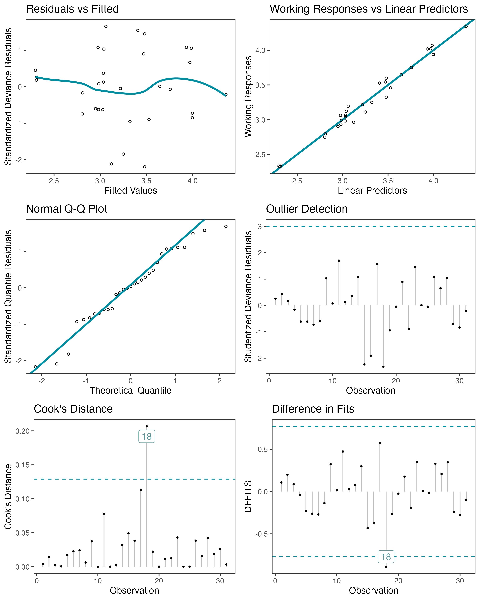

**Half-Normal Plot**

```{r}
model <- lm(ybar ~ (A+B+C+D)^4,data=adapted_epitaxial)
half_normal(model)
```


```{r}
half_normal(model,method='Zahn',alpha=0.1,
            ref_line=TRUE,label_active=TRUE,
            margin_errors=TRUE)
```


**Interaction Effects Plot (Factorial Design)**

Interaction effects plot between two factors in a factorial design


```{r,fig.width=8,fig.height=6}
interaction_effects(adapted_epitaxial,response = 'ybar',
                    exclude_vars = c('s2','lns2'))
```


```{r,fig.width=9,fig.height=4}
interaction_effects(adapted_epitaxial,response = 'ybar',
                    exclude_vars = c('A','s2','lns2'),
                    n_columns=3)
```


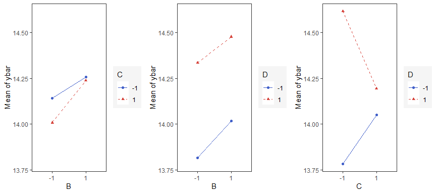

**Main Effects Plots (Factorial Design)**

Main effect plots for each factor in a factorial design

```{r}
main_effects(original_epitaxial,
             response='s2',
             exclude_vars = c('ybar','lns2'))
```


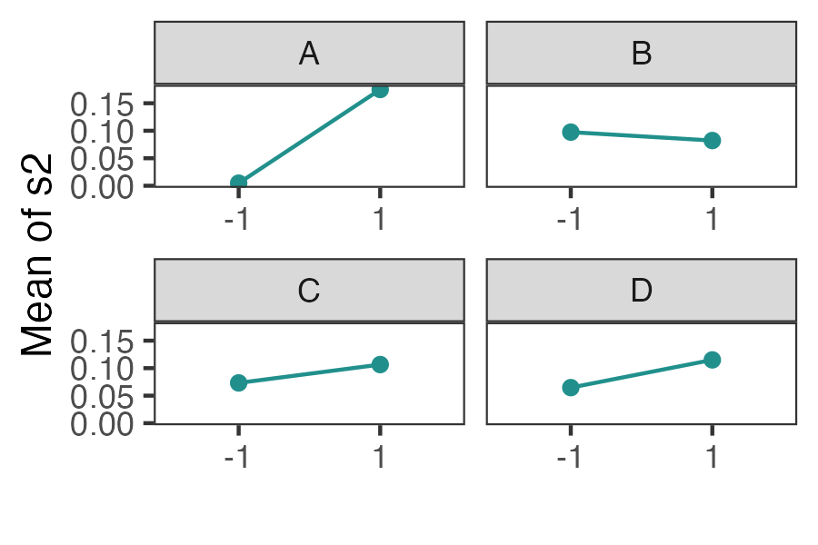


```{r}
main_effects(original_epitaxial,
             response='s2',
             exclude_vars = c('A','ybar','lns2'),
             color_palette = 'viridis',
             n_columns=3)
```


**Contour Plots**

contour plot(s) that display the fitted surface for an *rsm* 
object involving two or more numerical predictors

```{r}
heli.rsm <- rsm::rsm(ave ~ SO(x1, x2, x3, x4), 
                     data = rsm::heli)
```


```{r}
gg_rsm(heli.rsm,form = ~x1+x2+x3+x4,
       at = rsm::xs(heli.rsm))
```


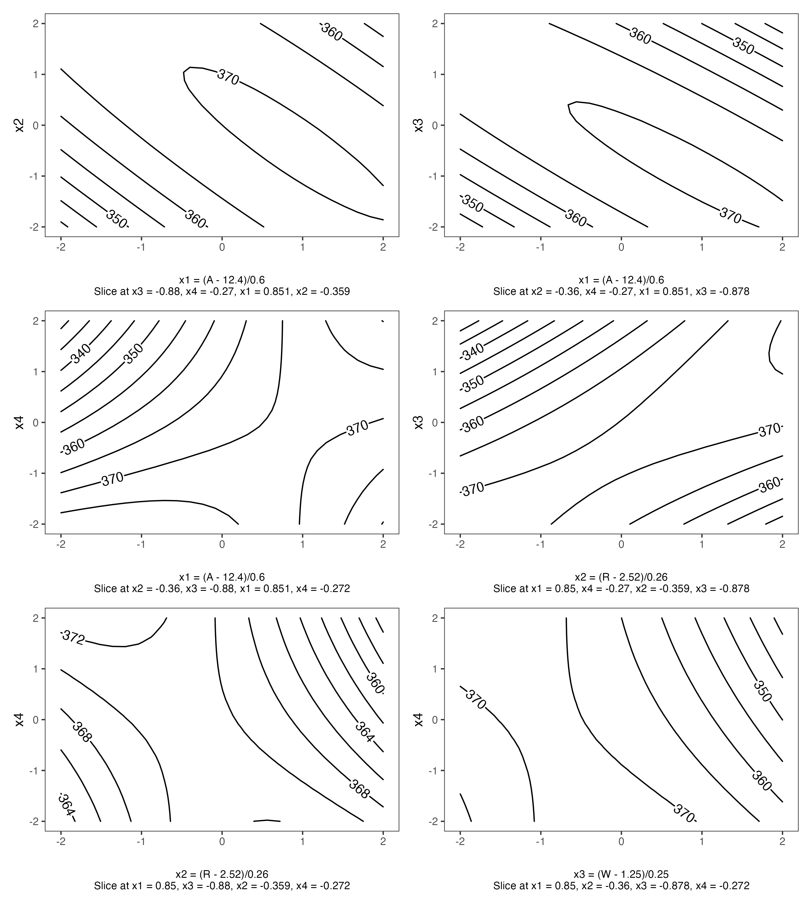


```{r}
gg_rsm(heli.rsm,form = ~x1+x2+x3+x4,
       at = rsm::xs(heli.rsm),
       filled = TRUE)
```

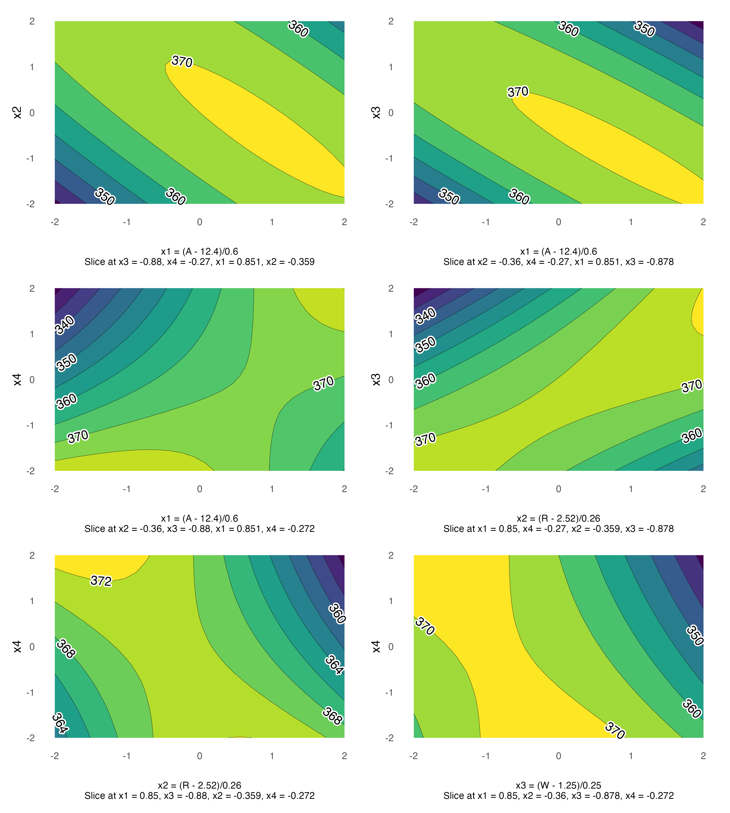


**Pareto Plot**

Pareto plot of effects with cutoff values for the margin of error (ME) and simultaneous margin of error (SME)

```{r}
model <- lm(lns2 ~ (A+B+C+D)^4,data=original_epitaxial)
pareto_plot(model)
```


```{r}
pareto_plot(model,method='Zahn',alpha=0.1)
```


**Two Dimensional Projections**

This function will output all two dimensional projections from a Latin hypercube design

```{r}
set.seed(10)
X <- lhs::randomLHS(n=10, k=4)
twoD_projections(X,n_columns=3,grid = TRUE)
```

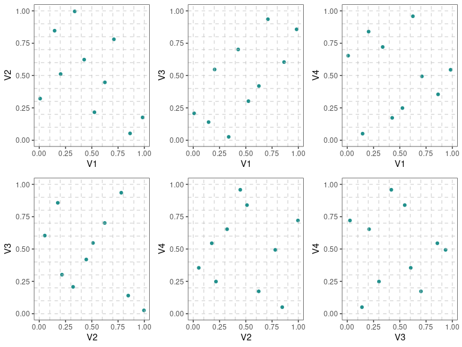

Lastly, the following datasets/designs are included in ggDoE as tibbles:

- **adapted_epitaxial**: Adapted epitaxial layer experiment obtain from the book <br>
*"Experiments: Planning, Analysis, and Optimization, 2nd Edition"*

- **original_epitaxial**: Original epitaxial layer experiment obtain from the book <br>
*"Experiments: Planning, Analysis, and Optimization, 2nd Edition"*

- **aliased_design**: D-efficient minimal aliasing design obtained from the article  <br>
*"Efficient Designs With Minimal Aliasing by Bradley Jones and Christopher J. Nachtsheim"* <br>
*Source:* <https://www.tandfonline.com/doi/abs/10.1198/TECH.2010.09113>

## Citation

If you want to cite this package in a scientific journal or in any other context, run the following code in your `R` console

```{r,eval=TRUE,comment=NA}
citation('ggDoE')
```

## Contributing to the package

I welcome feedback, suggestions, issues, and contributions!
Check out the [CONTRIBUTING](https://github.com/toledo60/ggDoE/blob/main/.github/CONTRIBUTING.md) file for more details.
