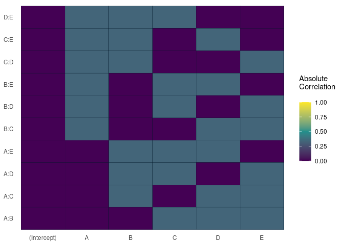
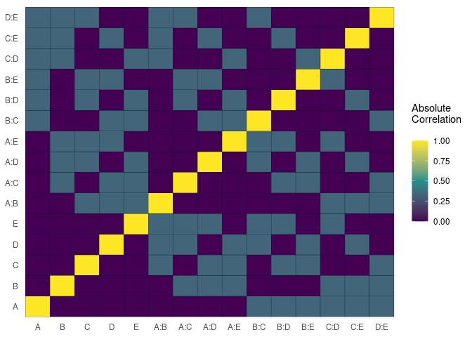
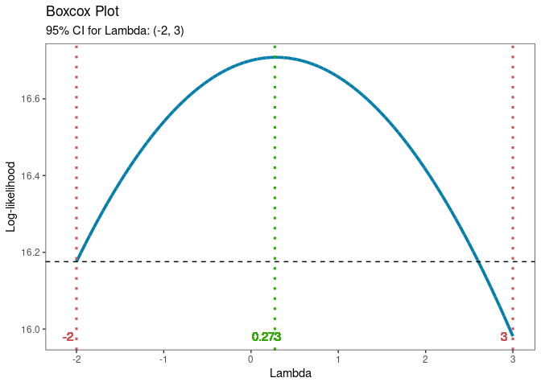
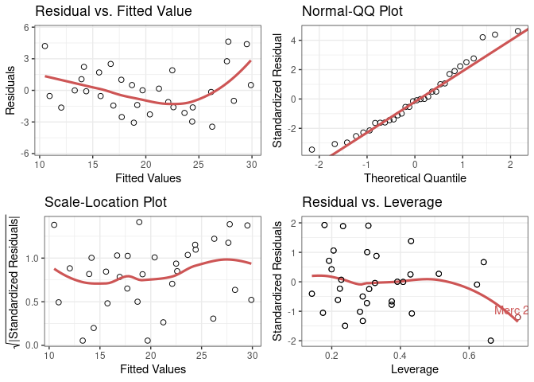
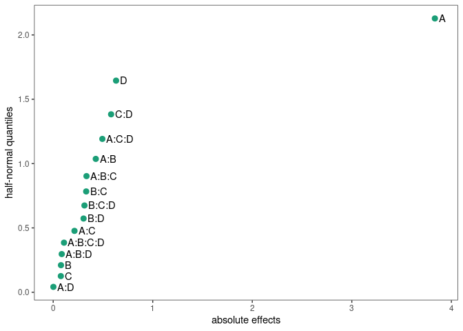
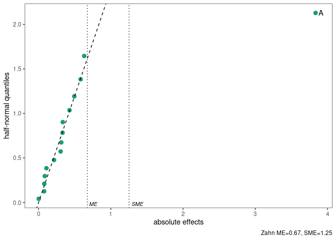
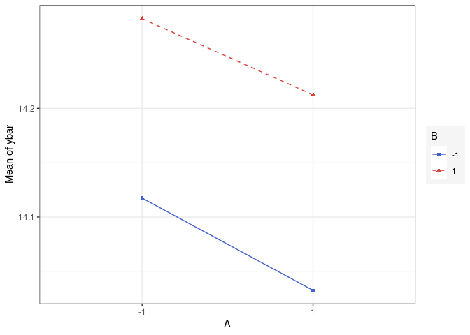
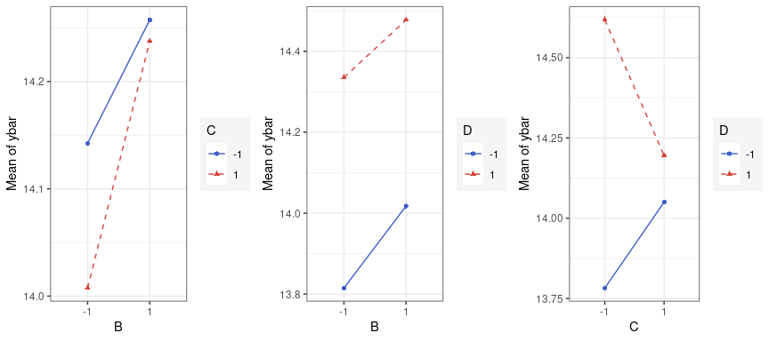
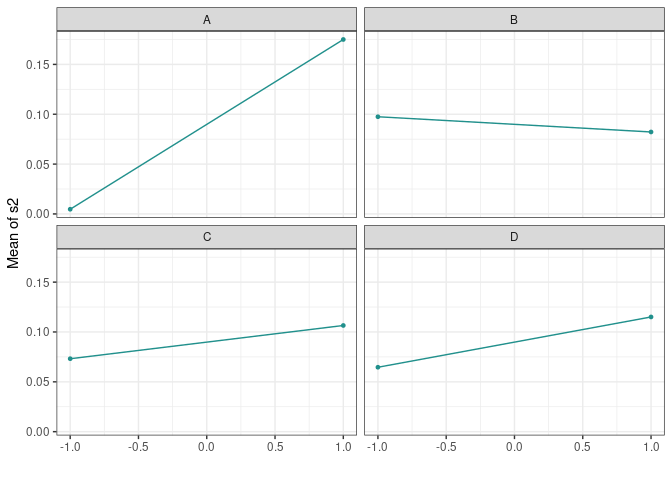
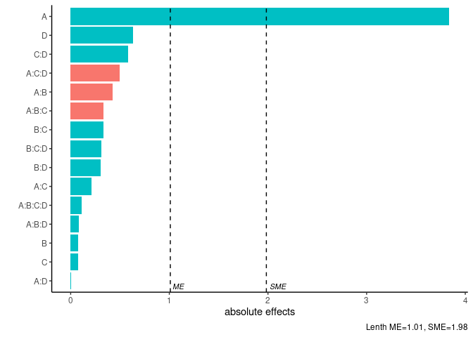

# ggDoE

[](https://github.com/toledo60/ggDoE/actions)
[](https://ggdoe.netlify.app/)
[](https://app.netlify.com/sites/ggdoe/deploys)

## Installation

You can get the development version from GitHub:

``` r
#install.packages("remotes") 
remotes::install_github("toledo60/ggDoE")
```

## Overview

With ggDoE you’ll be able to generate common plots used in Design of
Experiments with ggplot2.

The following plots are currently available:

-   [alias_matrix()](https://ggdoe.netlify.app/reference/alias_matrix.html):
    Correlation matrix plot to visualize the Alias matrix

-   [boxcox_transform()](https://ggdoe.netlify.app/reference/boxcox_transform.html):
    Boxcox transformation plot

-   [diagnostic_plots()](https://ggdoe.netlify.app/reference/diagnostic_plots.html):
    Regression diagnostics plots

-   [half_normal()](https://ggdoe.netlify.app/reference/half_normal.html):
    Half-Normal effects plot

-   [interaction_effect()](https://ggdoe.netlify.app/reference/interaction_effect.html):
    Interaction effects plot between two factors in a factorial design

-   [main_effect()](https://ggdoe.netlify.app/reference/main_effect.html):
    Main effect plot for one factor in a factorial design

-   [pareto_plot()](https://ggdoe.netlify.app/reference/pareto_plot.html):
    Pareto plot of effects with cutoff values for the margin of error
    (ME) and simultaneous margin of error (SME)

``` r
library(ggDoE)
```

**Alias Matrix**

``` r
alias_matrix(design=aliased_design)
```

<!-- -->

``` r
alias_matrix(design=aliased_design, symmetric=TRUE,
             intercept=FALSE)
```

<!-- -->

**Box-Cox Transformation**

``` r
model <- lm(s2 ~ (A+B+C+D),data = adapted_epitaxial)
boxcox_transform(model,lambda = seq(-2,3,0.2))
```

<!-- -->

**Regression Diagnostic Plots**

``` r
data(mtcars)
mtcars_lm <- lm(mpg ~.,data=mtcars)
diagnostic_plots(mtcars_lm)
```

<!-- -->

**Half-Normal Plot**

``` r
m1 <- lm(lns2 ~ (A+B+C+D)^4,data=original_epitaxial)
half_normal(m1)
```

<!-- -->

``` r
half_normal(m1,method='Zahn',alpha=0.1,
            ref_line=TRUE,label_active=TRUE,
            showME=TRUE)
```

<!-- -->

**Interaction Effects Plot (Factorial Design)**

``` r
interaction_effect(data = adapted_epitaxial, factor_1 = A,
                   factor_2 = B, response_var = ybar)
```

<!-- -->

**Main Effects Plots (Factorial Design)**

``` r
main_effect(data = adapted_epitaxial, factor_1 = B, 
            response_var = ybar)
```

<!-- -->

**Pareto Plot**

``` r
m1 <- lm(lns2 ~ (A+B+C+D)^4,data=original_epitaxial)
pareto_plot(m1)
```

<!-- -->

``` r
pareto_plot(m1,method='Zahn',alpha=0.1)
```

<!-- -->

### Contributing to the package

I welcome feedback, suggestions, issues, and contributions! Check out
the
[CONTRIBUTING](https://github.com/toledo60/ggDoE/blob/main/.github/CONTRIBUTING.md)
file for more details.
