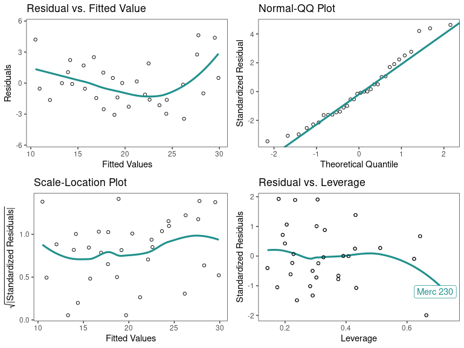
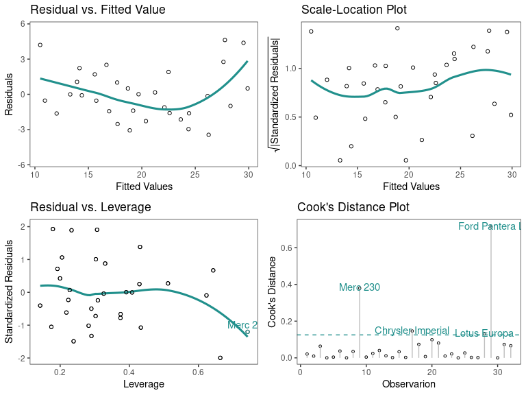

# ggDoE

[](https://github.com/toledo60/ggDoE/actions)
[](https://ggdoe.netlify.app/)
[](https://app.netlify.com/sites/ggdoe/deploys)

## Installation

You can get the development version from GitHub:

``` r
if (!require("remotes")) install.packages("remotes")
remotes::install_github("toledo60/ggDoE")
```

## Overview

With ggDoE you’ll be able to generate common plots used in Design of
Experiments with ggplot2.

``` r
library(ggDoE)
```

The following plots are currently available:

**Alias Matrix**

Correlation matrix plot to visualize the Alias matrix

``` r
alias_matrix(design=aliased_design)
```


**Box-Cox Transformation**

``` r
model <- lm(s2 ~ (A+B+C+D),data = adapted_epitaxial)
boxcox_transform(model,lambda = seq(-5,5,0.2))
```


**Lambda Plot**

Obtain the trace plot of the *t*-statistics after applying Boxcox
transformation across a specified sequence of lambda values

``` r
model <-  lm(s2 ~ (A+B+C)^2,data=original_epitaxial)
lambda_plot(model)
```


``` r
lambda_plot(model, lambda = seq(0,2,by=0.1))
```


**Boxplots**

``` r
data <- ToothGrowth
data$dose <- factor(data$dose,levels = c(0.5, 1, 2),
                    labels = c("D0.5", "D1", "D2"))

gg_boxplots(data,response = len,
            factor = dose)
```


``` r
gg_boxplots(data,response = len,
            factor = dose,
            group_var = supp,
            color_palette = 'viridis')
```


**Regression Diagnostic Plots**

1.  Residual vs. Fitted Values
2.  Normal-QQ plot
3.  Scale-Location plot
4.  Residual vs. Leverage
5.  Cook’s Distance

``` r
data(mtcars)
mtcars_lm <- lm(mpg ~.,data=mtcars)
diagnostic_plots(mtcars_lm)
```



``` r
diagnostic_plots(mtcars_lm,
                 which_plots=c(1,3,4,5))
```



**Half-Normal Plot**

``` r
m1 <- lm(lns2 ~ (A+B+C+D)^4,data=original_epitaxial)
half_normal(m1)
```


``` r
half_normal(m1,method='Zahn',alpha=0.1,
            ref_line=TRUE,label_active=TRUE,
            margin_errors=TRUE)
```


**Interaction Effects Plot (Factorial Design)**

Interaction effects plot between two factors in a factorial design

``` r
interaction_effects(adapted_epitaxial,response = 'ybar',
                    exclude_vars = c('s2','lns2'))
```


``` r
interaction_effects(adapted_epitaxial,response = 'ybar',
                    exclude_vars = c('A','s2','lns2'),
                    ncols=3)
```


**Main Effects Plots (Factorial Design)**

Main effect plots for each factor in a factorial design

``` r
main_effects(original_epitaxial,
             response='s2',
             exclude_vars = c('ybar','lns2'))
```


``` r
main_effects(original_epitaxial,
             response='s2',
             exclude_vars = c('A','ybar','lns2'),
             color_palette = 'viridis',
             ncols=3)
```


**Pareto Plot**

Pareto plot of effects with cutoff values for the margin of error (ME)
and simultaneous margin of error (SME)

``` r
m1 <- lm(lns2 ~ (A+B+C+D)^4,data=original_epitaxial)
pareto_plot(m1)
```


``` r
pareto_plot(m1,method='Zahn',alpha=0.1)
```


Lastly, the following datasets/designs are included in ggDoE as tibbles:

-   **adapted_epitaxial**: Adapted epitaxial layer experiment obtain
    from the book <br> *“Experiments: Planning, Analysis, and
    Optimization, 2nd Edition”*
    [source](https://www2.isye.gatech.edu/~jeffwu/wuhamadabook/data/originallayer.dat)
-   **original_epitaxial**: Original epitaxial layer experiment obtain
    from the book <br> *“Experiments: Planning, Analysis, and
    Optimization, 2nd Edition”*
    [source](https://www2.isye.gatech.edu/~jeffwu/wuhamadabook/data/originallayer.dat)
-   **aliased_design**: D-efficient minimal aliasing design obtained
    from the article <br> *“Efficient Designs With Minimal Aliasing”*
    [source](https://www.tandfonline.com/doi/abs/10.1198/TECH.2010.09113)

### Contributing to the package

I welcome feedback, suggestions, issues, and contributions! Check out
the
[CONTRIBUTING](https://github.com/toledo60/ggDoE/blob/main/.github/CONTRIBUTING.md)
file for more details.
